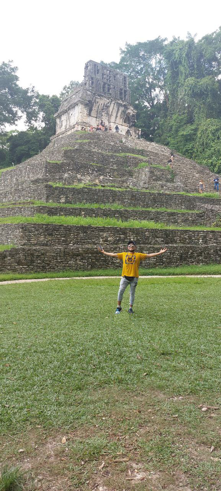

<h1>Mi Biografia</h1>

Soy estudiante de Informática en la <em>Universidad Mayor de San Andrés (UMSA)</em>, donde estoy dando forma a mi pasión por la tecnología. Me encanta el mundo del backend porque me fascina la idea de conectar sistemas y crear estructuras eficientes que realmente impacten. Cada línea de código es un paso hacia mi desarrollo profesional.
Además de mi enfoque en la programación, el baile forma parte de mi esencia. Es una manera de expresarme y de conectarme con las emociones. Cuando suena el rock, algo dentro de mí se enciende—es un género que me inspira profundamente, desde su energía hasta sus historias.
También tengo una relación especial con Sudamérica. He tenido la fortuna de viajar y conocer muchos países de la región, cada uno con sus particularidades y su riqueza cultural. Estos viajes me han permitido abrir mi mente y entender mejor el mundo que me rodea, siempre llevando conmigo el orgullo de ser boliviano.
Así soy yo: un amante de la tecnología, el baile, el rock y los viajes. Siempre en busca de aprender más y superar nuevos desafíos.

<h2> Pasiones: </h2>
<ul>
<li>Danza folklorica</li>
<li>Rock</li>
<li>Leer</li>
<li>Caminar</li>
<li>Conocer Paises</li>
</ul>
